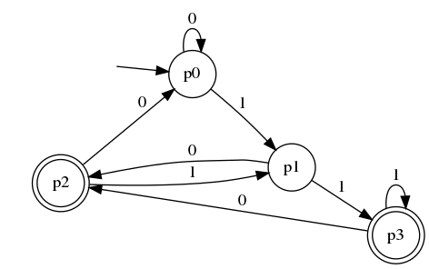
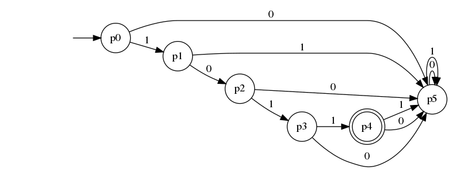

# Sample Exam1

This is part of a previous exam with solution. You write your solution in the
question.desc file where question is the number of the question listed below. Your solution will automatically be transformed into an FA graph as shown in the figure below. This might prevent you from making mistakes.
## Write a DFA for the following
1. Let L={w in {0,1}*  such that the penultimate symbol in w is a 1}
  
Write your answer (use open in new tab) [here](1.desc)

After you commit a graphics of your answer will appear below (it might take some time)
 

2. Let L={w in {0,1}* | w has at least one zero and every zero is preceded exactly by one 1
   and followed exactly by one 1}
   
Write your answer (use open in new tab) [here](2.desc)

After you commit a graphics of your answer will appear below (it might take some time)

3. Let L={w in {0,1}*| the substring 1001 occurs at least once in w}

Write your answer (use open in new tab) [here](3.desc)

After you commit a graphics of your answer will appear below (it might take some time)

4. Let L={w in {0,1}*|  w has no two consecutive 1's}

Write your answer (use open in new tab)  [here](4.desc)

After you commit a graphics of your answer will appear below (it might take some time)

5. Let L={w in {0,1}*}

Write your answer (use open in new tab)   [here](5.desc)

After you commit a graphics of your answer will appear below (it might take some time)

## Write an NFA for the following

6. L= { w in {a,b}*| w=(e U an)bm} where e is the 
empty string

Write your answer (use open in new tab) [here](6.desc)

After you commit a graphics of your answer will appear below (it might take some time)

7. L= { w in {a,b}*| w starts and ends with the same symbol and |w|>1 } 

Write your answer (use open in new tab) [here](7.desc)

After you commit a graphics of your answer will appear below (it might take some time)

8. L= { w in {0,1}*| the third symbol from the right of w is a one  } 

Write your answer (use open in new tab) [here](8.desc)

After you commit a graphics of your answer will appear below (it might take some time)

9. L= { w in {0,1}*| w contains the substring 0101 } 

Write your answer (use open in new tab) [here](9.desc)

After you commit a graphics of your answer will appear below (it might take some time)

10. L= { w in {a,b,c}*| if w contains b it does not contain c and vice versa} 

Write your answer (use open in new tab) [here](10.desc)

After you commit a graphics of your answer will appear below (it might take some time)

11. L= { w in {a,b}*| w=(ab)n} 

Write your answer (use open in new tab) [here](11.desc)

After you commit a graphics of your answer will appear below (it might take some time)

